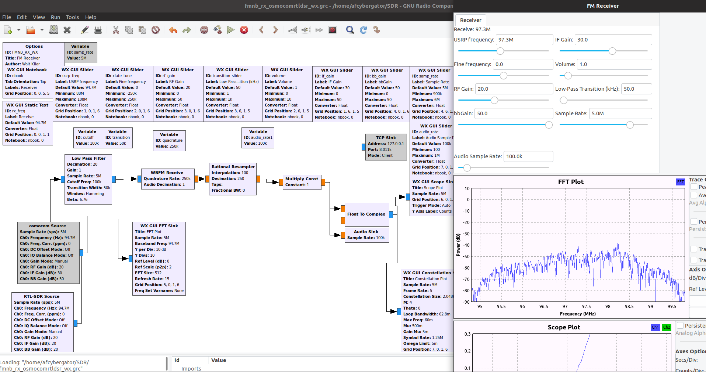
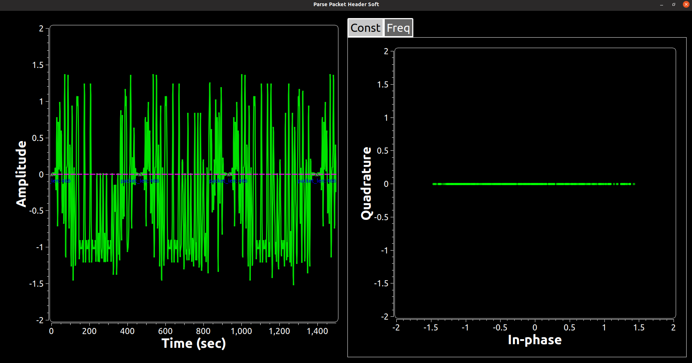

# SDR
Software Defined Radio (SDR) projects on the Hack RF One by Great Scott Gadgets

## Quadrature Phase Shift Keying (QPSK)/ 4-PSK/ 4 Quadrature Amplitude Modulation (4-QAM)
QPSK is a form of phase modulation technique, in which two information bits (combined as one symbol) are modulated at once, selecting one of the four possible carrier phase shift states (pi/4, 3pi/4, 5pi/4, 7pi/4 radians).

Note that the the cosine and sine portions of the signal are out of phase from one another by 90 degrees or pi/2 radians, or quadrature. This signal can be presented as an in-phase and quadrature-phase, or I and Q. 
Sequence of events:

1. A splitter separates odd and even bits
2. Each bit is over-sampled at 
3. Even and odd bits are independently sent through rectangular pulse shaping filter . I(t) is multiplied by  and Q(t) is multiplied by .
4. I(t) and Q(t) and  are summed to create s(t).

In MatLab this is represented as follows:
```function [s,t,I,Q] = qpsk_mod(a,fc,OF)
%Modulate an incoming binary stream using conventional QPSK
%a - input binary data stream (0's and 1's) to modulate
%fc - carrier frequency in Hertz
%OF - oversampling factor (multiples of fc) - at least 4 is better
%s - QPSK modulated signal with carrier
%t - time base for the carrier modulated signal
%I - baseband I channel waveform (no carrier)
%Q - baseband Q channel waveform (no carrier)
L = 2*OF;%samples in each symbol (QPSK has 2 bits in each symbol)
ak = 2*a-1; %NRZ encoding 0-> -1, 1->+1
I = ak(1:2:end);Q = ak(2:2:end);%even and odd bit streams
I=repmat(I,1,L).'; Q=repmat(Q,1,L).';%even/odd streams at 1/2Tb baud
I = I(:).'; Q = Q(:).'; %serialize
fs = OF*fc; %sampling frequency
t=0:1/fs:(length(I)-1)/fs; %time base
iChannel = I.*cos(2*pi*fc*t);qChannel = -Q.*sin(2*pi*fc*t);
s = iChannel + qChannel; %QPSK modulated baseband signal
```
Within GRC, the PSK Modulator handles the processing above. 

### QPSK Transmitter (Qt implementation)


### QPSK Transmitter (wxWidget implementation)


### MPSK Transmitter (Multiple Phase Shift Keying) (Qt implementation)


## Frequency Modulation (FM)
FM is the encoding of information in a carrier wave by varying the instantaneous frequency of the wave. The digital version of FM is frequency shift keying (FSK).

```
function [y_FM_demodulated] = FM_IQ_Demod(y) 
%differentiate input 
b = firls(30,[0 .9],[0 1],'differentiator'); 
%normalize the amplitude (i.e. remove amplitude variations)
d=y./abs(y); 
%real part of normalized signal.
rd=real(d);  
%imaginary part of normalized signal. 
id=imag(d);  
y_FM_demodulated=(rd.*conv(id,b,'same')-id.*conv(rd,b,'same'))./(rd.^2+id.^2); 
end
```



## Orthogonal Frequency Division Multiplexing (OFDM)
Orthogonal frequency division modulation (OFDM) divides a high-rate transmit data stream into N lower-rate streams, each of which has a symbol duration larger than the channel delay spread. This serves to mitigate intersymbol interference (ISI). The individual substreams are sent over N parallel subchannels which are orthogonal to each other. Through the use of an inverse fast Fourier transform (IFFT), OFDM can be transmitted using a single radio. Specifically, the OFDM Modulator System object modulates an input signal using orthogonal frequency division modulation. 
```
% generate header and trailer (an exact copy of the header)
f = 0.25; 
header = sin(0:f*2*pi:f*2*pi*(head_len-1)); 
f=f/(pi*2/3); 
header = header+sin(0:f*2*pi:f*2*pi*(head_len-1)); 
% arrange data into frames and transmitframe_guard = zeros(1, symb_period); 
time_wave_tx = []; 
symb_per_carrier = ceil(length(baseband_tx)/carrier_count); 
fig = 1; 
if (symb_per_carrier > symb_per_frame)  % === multiple frames === %    
	power = 0; 
	while 
		~isempty(baseband_tx) 
		% number of symbols per frame        
		frame_len = min(symb_per_frame*carrier_count,length(baseband_tx));         
		frame_data = baseband_tx(1:frame_len); 
		% update the yet-to-modulate data        
		baseband_tx = baseband_tx((frame_len+1):(length(baseband_tx))); 
		% OFDM modulation        
		time_signal_tx = ofdm_modulate(frame_data,ifft_size,carriers,conj_carriers, carrier_count, symb_size, guard_time, fig);         
		fig = 0; 
		%indicate that ofdm_modulate() has already generated plots% add a frame guard to each frame of modulated signal        
		time_wave_tx = [time_wave_tx frame_guard time_signal_tx];         
		frame_power = var(time_signal_tx); 
		end
		% scale the header to match signal level    
		power = power + frame_power; 
		% The OFDM modulated signal for transmission    
		time_wave_tx = [power*header time_wave_tx frame_guard power*header]; 
else
		% === single frame === %
		% OFDM modulation    
		time_signal_tx = ofdm_modulate(baseband_tx,ifft_size,carriers,...        conj_carriers, carrier_count, symb_size, guard_time, fig); 
		% calculate the signal power to scale the header    
		power = var(time_signal_tx); 
		% The OFDM modulated signal for transmission    
		time_wave_tx = [power*header frame_guard time_signal_tx frame_guard power*header]; 
end
```


## Packet Header Parser


